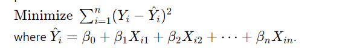

## Linear Regression

### Introduction

Linear regression is a statistical method used to model the relationship between a dependent variable and one or more independent variables. The goal is to find the linear equation that best predicts the dependent variable based on the independent variables.

### Simple Linear Regression

Simple linear regression involves one independent variable (\\(X\\)) and one dependent variable (\\(Y\\)). The relationship is modeled by the equation:

Y=β0​+β1​X+ϵ

* Y: Dependent variable
* X: Independent variable
* 𝛽​: Intercept
* 𝛽1:Slope
* 𝜖: Error term

### Multiple Linear Regression

Multiple linear regression involves two or more independent variables. The relationship is modeled by the equation:

### Assumptions of Linear Regression

1. **Linearity**: The relationship between the independent and dependent variables is linear.

2. **Independence**: The residuals (errors) are independent.

3. **Homoscedasticity**: Constant variance of the residuals.

4. **Normality**: The residuals of the model are normally distributed.\

### Optimization Techniques in Linear Regression\

#### 1. **Ordinary Least Squares (OLS)**

The most common method to estimate the coefficients in linear regression is the Ordinary Least Squares method. It minimizes the sum of the squared differences between the observed and predicted values.

#### 2. **Gradient Descent**

Gradient Descent is an iterative optimization algorithm used to minimize the cost function. The steps include:

#### 3. **Stochastic Gradient Descent (SGD)**

SGD is a variant of Gradient Descent that updates the coefficients after evaluating the cost function for each training example, rather than the entire dataset. This can lead to faster convergence.\

#### 4. **Mini-Batch Gradient Descent**

Mini-Batch Gradient Descent is a compromise between Batch Gradient Descent and Stochastic Gradient Descent. It updates the coefficients using small random subsets (mini-batches) of the dataset.\

#### 5. **Regularization Techniques**

Regularization adds a penalty term to the cost function to prevent overfitting.

### Evaluation Metrics

1. **Mean Absolute Error (MAE)**: Average of absolute differences between actual and predicted values.

2. **Mean Squared Error (MSE)**: Average of squared differences between actual and predicted values.

3. **Root Mean Squared Error (RMSE)**: Square root of MSE.

4. **R-squared ( R^2)**: Proportion of variance in the dependent variable that is predictable from the independent variables.

### Conclusion

Linear regression is a fundamental technique for modeling the relationship between variables. Understanding its assumptions, optimization methods, and evaluation metrics is crucial for building and interpreting linear models effectively.

### Task and Python Functions needed to perform Linear Regression

| Task                         | Python Function                                                    |
|------------------------------|--------------------------------------------------------------------|
| Importing Libraries          | `import numpy as np` `import pandas as pd` `from sklearn.model_selection import train_test_split` `from sklearn.linear_model import LinearRegression, Ridge, Lasso, ElasticNet` `from sklearn.metrics import mean_absolute_error, mean_squared_error, r2_score` |
| Split Data                   | `train_test_split(X, y, test_size=0.2, random_state=42)`           |
| Fit Simple Linear Regression | `model = LinearRegression().fit(X_train, y_train)`                |
| Fit Ridge Regression         | `model = Ridge(alpha=1.0).fit(X_train, y_train)`                  |
| Fit Lasso Regression         | `model = Lasso(alpha=1.0).fit(X_train, y_train)`                  |
| Fit ElasticNet Regression    | `model = ElasticNet(alpha=1.0, l1_ratio=0.5).fit(X_train, y_train)`|
| Predict                      | `y_pred = model.predict(X_test)`                                   |
| Mean Absolute Error (MAE)    | `mean_absolute_error(y_test, y_pred)`                              |
| Mean Squared Error (MSE)     | `mean_squared_error(y_test, y_pred)`                               |
| Root Mean Squared Error (RMSE)| `np.sqrt(mean_squared_error(y_test, y_pred))`                      |
| R-squared (R²)               | `r2_score(y_test, y_pred)`                                         |
